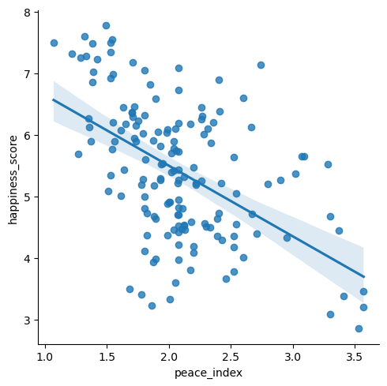
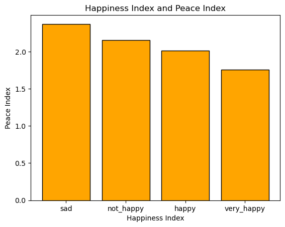
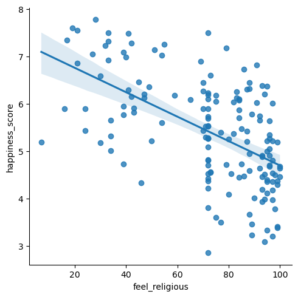
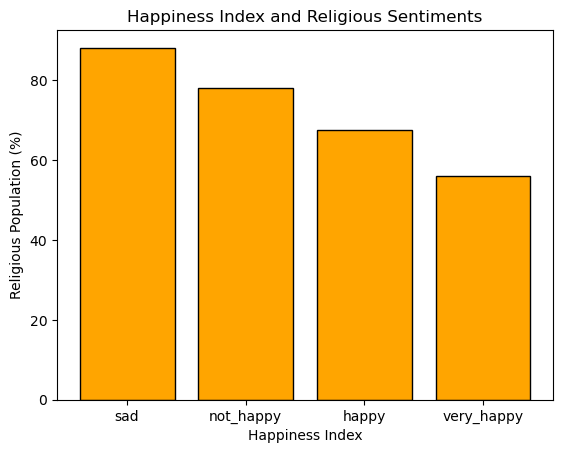

# ETL and analysis project: HAPPINESS

Extraction, transformation and loading project about happiness

## 1. Project Description.

This project focuses on extracting and transforming data, as well as creating an operational database using MySQL Workbench.

The aim of the project is to explore the relationship between happiness, religious sentiments, and safety across different countries.

Additionally, this project includes conducting detailed analysis and deriving valuable insights from the data.

## 2. Data Extraction

The data for this project has been extracted from three different sources using two different extraction methods:

[kaggle:](https://www.kaggle.com/)
The happiness index data from 2019 was downloaded as a CSV document, providing information about the happiness index in different countries.

[Institute for Economics and Peace:](https://en.wikipedia.org/wiki/Global_Peace_Index) A scraping process was performed to extract table data related to the global peace index in countries. The data used for analysis is from 2019.

[Ceoworld Magazine](https://ceoworld.biz/2020/05/16/revealed-the-worlds-most-and-least-religious-countries-based-on-religious-beliefs-2020/) Another web scraping process was used to extract table data related to religious beliefs in different countries.

## 3. Data Cleaning ant Transformation

To ensure the dataset is ready for database creation in MySQL Workbench and subsequent data analysis, the data underwent a series of cleaning and transformation steps. The following actions were taken to clean and prepare the data:

- The downloaded CSV document, which will be referred to as "happiness" dataset from now on, underwent a comprehensive cleaning process. Using the Python library "Pandas", the data was transformed into a DataFrame. During the cleaning process, the DataFrame was narrowed down to include only three essential columns: the country name, the country ID, and the happiness index. Since the remaining information in the original table was deemed irrelevant to the project's objectives, it was excluded from the final DataFrame.

- We performed web scraping to gather information about the Global Peace Index. The scraped data was then used to create a DataFrame, which underwent cleaning to focus on two crucial columns: the country and the peace index. The resulting DataFrame was then left-joined with the original "happiness" table, combining the relevant information from both sources.

- We conducted web scraping to gather data on the number of religious individuals per country. The scraped data was utilized to create a DataFrame which underwent a cleaning process, narrowing down the focus to two essential columns: the country and the belief feelings. Subsequently, the resulting DataFrame was left-joined with the original "happiness" table, combining the relevant information from both sources.

- The final DataFrame, "happiness," was exported as a CSV document to facilitate its import into MySQL Workbench.

## 4. Creation of the database:

A new database named "database_happiness_code" was created using MySQL Workbench. A relational model (RRE) named "Happiness_model_MySQL" was also developed to visualize the table, columns, and the information contained within.

## 5. Data Analysis

The data was analyzed using various Python libraries, which included statistical analysis techniques such as calculating correlations between variables, generating scatter plots, bar charts, and more. These analytical methods were employed to gain insights and examine relationships within the dataset.

Based on the analysis, several conclusions can be drawn:

- There is a positive correlation, although not very strong, between the safety level of a country and its happiness index. This implies that countries with higher safety tend to have higher happiness scores. It should be noted that a higher peace_index level indicates a less safe country.

- Conversely, there is a negative correlation between the percentage of religious individuals in a country and its happiness index. This suggests that countries with a higher percentage of religious people tend to have lower happiness scores.

These findings provide valuable insights into the relationships between safety, religiosity, and happiness, highlighting the complex dynamics involved in determining a country's overall happiness.

## 6. Documents in this repository:

This repository consists of the following documents and folders:

### Data folder
It contains two subfolders:
- Cleaned: This subfolder contains the cleaned CSV file, "happiness_cleaned", which was exported from Python after the cleaning process.
- Raw: This subfolder contains the raw CSV document, "happiness_raw", that was initially obtained.

### Jupyter notebook folder
This folder contains a Jupyter notebook named "Happiness" that provides detailed information about the data cleaning, transformation, and analysis process. The notebook covers each step thoroughly, offering insights into the methodology and findings of the project.

### Src folder
This folder contains a .sql document that includes the SQL code and data necessary to implement the new database. Additionally, the document includes the Relational Model (RRE) for the database, providing a visual representation of the tables and their relationships.

### Graphs folder
This folder contains .png files of the graphs obtained from the data analysis. These visualizations provide insights and visual representations of the relationships and patterns identified during the analysis process.

### Readme
The README file provides a comprehensive overview of the project, including the project description, data extraction, cleaning, analysis, and conclusions. It serves as a guide for users to understand the project's purpose and the steps involved.

[LinkedIn profile of the author](https://www.linkedin.com/in/david-n%C3%BA%C3%B1ez-pastrana-595ba684/)